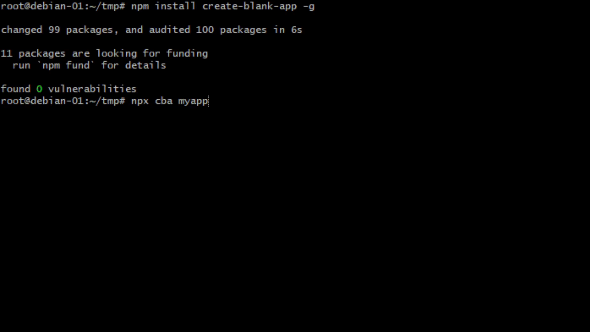

# Create-Blank-App (CBA)

`create-blank-app (cba)` - just one command to remember. CBA is a command-line tool for creating a new app by searching for tech stacks using keywords.

Support:
- Angular, create-react-app (CRA), create-next-app (CNA), create-web3js-app (CWA), create-react-native-app (Expo), react-native init.
- Vite: vue, react, preact, lit-element, svelte app.
- Typescript.

```
Installation & Usage
    $ npm install create-blank-app -g
    $ create-blank-app <name> <keyword1 keyword2 etc.>
OR:
    $ cba <name> <keyword1 keyword2 etc.>

Examples:
    $ cba myapp vite react ts
    $ cba myapp cra ts
```


