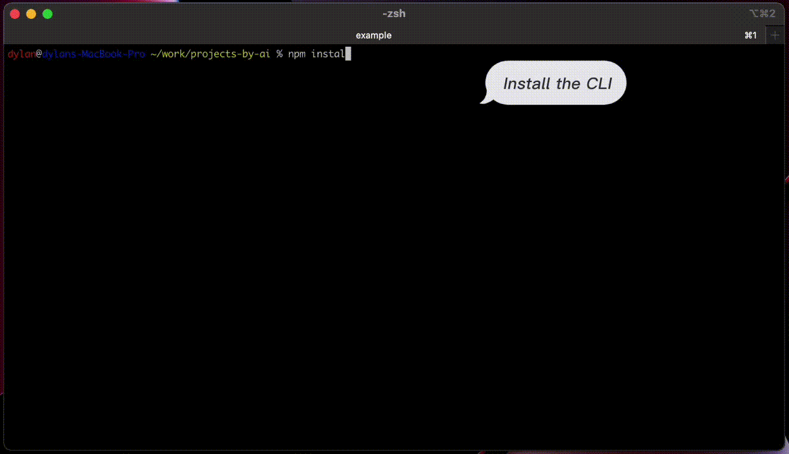

# Create-Blank-App (CBA)

`create-blank-app (cba)` - just one command to remember. CBA is a command-line tool for creating a new app by searching for tech stacks using keywords. It also supports generative AI.

Support:
- Angular, create-react-app (CRA), create-next-app (CNA), create-web3js-app (CWA), express-generator-typescript, create-react-native-app (Expo), react-native init.
- Vite: vue, react, preact, lit-element, svelte app.
- Typescript.
- Support ChatGPT to generate a new app using prompt file.
- Addons: install and configure libraries into existing project (see more below).

```
Installation:   $ npm install create-blank-app -g

Usage:          $ cba <name> <keyword1 keyword2 etc.>

Examples:
    $ cba myapp vite react ts
    $ cba myapp cra ts
    $ cba madebyai (assume that you have 'madebyai/prompt' file)
```



### Addons:

- You can run addon scripts to install and set up libraries to an existing project.

```
$ cd project
$ cba --add tailwind
```

- Addon List:
  - `github-action-ci`: basic Github Action CI workflow.
  - `nodemon`: for backend: auto reload when a file changed.
  - `tailwind`
  - `react-router`
  - `prisma`: for backend: added prisma, @prisma/client and examples of tables, /users route.

### ChatGPT:

Support ChatGPT to generate a new app using prompt file:
- Set OpenAI api key like `$ export OPENAI_API_KEY=<yourkey>`
- Create an empty directory, inside, write your prompt in the "prompt" file (or "prompt.gpt4" for gpt-4 model).
- Outside that directory, run: `$ cba <name>`

### Development:

- For development of CBA, see: [/docs/dev.md](/docs/dev.md)
